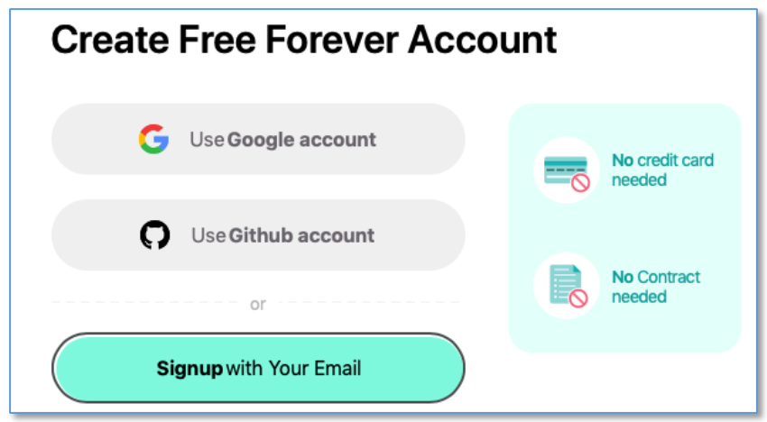
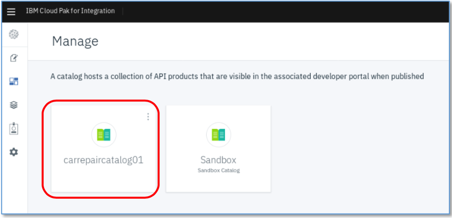
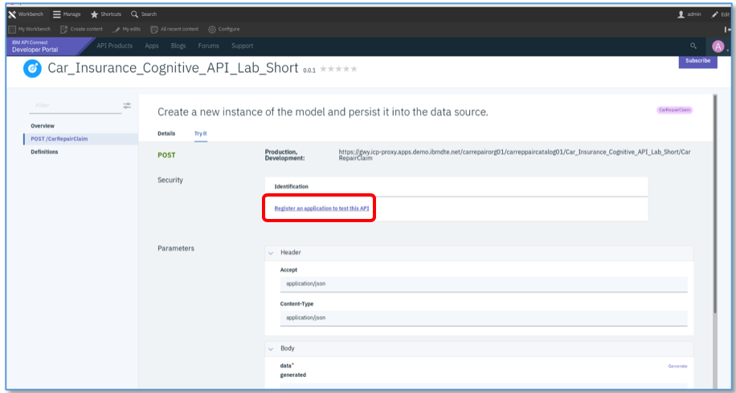
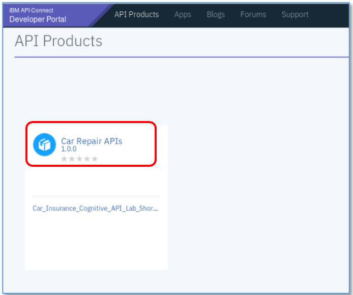
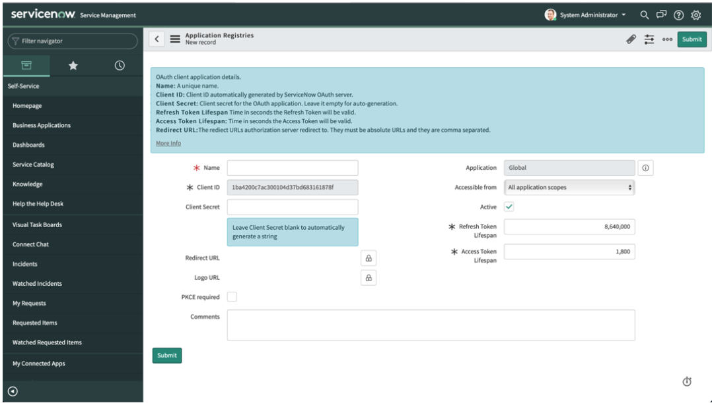
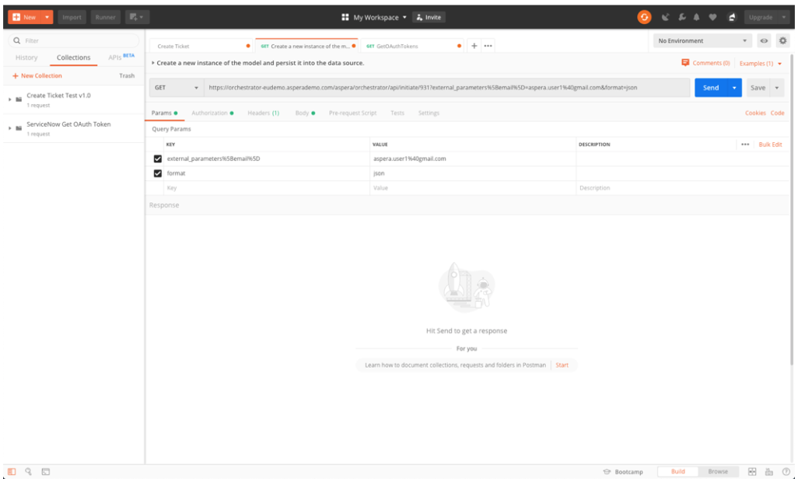

# Manage and Secure Cognitive Car Claim Processing API with ICP4i API Lifecycle Management

This tutorial is a part of the series [API-led Application Integration with IBM Cloud Pak for Integration](https://github.ibm.com/muralidhar-chavan/api-led-integration) . In the [preceeding tutorial](https://github.ibm.com/muralidhar-chavan/api-led-integration/tree/master/Application%20Integration) we built an Integration application flow connecting Salesforce, and some of the Watson AI services. The integration application exposed an API.

In this tutorial we will add API management capabilities of ICP4i to the API that we built earlier so that we expose the APIs to the outside world in a controlled manner. 

We will demonstrate the following:

- Seamlessly, push APIs to API Connect
- Manage and secure APIs
- Create developer portal to serve APIs

In order to run through this tutorial, you should have executed the tutorial [Build a Cognitive Car Claim Processing application with ICP4i Integration capabilities](https://github.ibm.com/muralidhar-chavan/api-led-integration/tree/master/Application%20Integration) of this series.


## Steps

1. [Configuring API Connect to Match our Organisation](#1-configuring-api-connect-to-match-our-organisation)
2. [Pushing our API to API Connect to be managed](#2-pushing-our-api-to-api-connect-to-be-managed)
3. [Managing our API using API Connect](#3-managing-our-api-using-api-connect)
4. [Creating a Portal](#4-creating-a-portal)
5. [Signing up as a Consumer of our API using Portal Self-Service](#5-signing-up-as-a-consumer-of-our-api-using-portal-self-service)
6. [Finished! And Summary](#6-finished!-and-summary)
7. [Extension Scenario](#7-extension-scenario)


## 1. Configuring API Connect to Match our Organisation

We’ve got our API running and working in App Connect – but now we need to expose it to the wider world in a controlled manner.

To do this we will use the API Management capabilities of ICP4i – they are provided by the API Connect capability.

We’ll do some configuration of API Connect to match how we want our organization to run.

### 1.1 Setting up API Connect ready to manage our API

First thing we need to do is set up API connect and manage it:

Go to The Cloud Pak menu, click `API Connect`, then the name of the instance and then on the three dot menu (…) and `Manage` as below.


(If you click on the instance name, you’ll end up in the API Manager – at the moment, we want to go to the API Cloud Manager…)

You’ll be asked which registry to sign in with – choose IBM Common Services user registry.

Whenever you sign in, getting the correct registry is very important as it determines your permissions.


You’ll now be in the API Connect Cloud Manager as below: Click on `Manage Organizations`


### 1.2 Creating a Provider Organization

A provider organization is a group of people that create and provide APIs to others. The others are consumers and have consumer organization.

ICP4i lets you have many provider organisations – this lets you separate groups or departments in your company for example. We’re going to create a new provider organization for this tutorial so we can provide our car-repair APIs.


Now click `Add` and `Create organization` (Your environment may already have an organization in it – please ignore that one – we’re going to create a new one)


Fill in the fields below:

We’re going to create a provider org called **carrepairorg01** with an owner of **repairadmin**

This is a new user.

The email address doesn’t actually matter (we’ll explain why later) – but we will need to give a password which conforms to the rules:

“**engageibmAPI1**” usually works – we’ll be using that a lot in this tutorial.


IMPORTANT: You’ll need to select the correct registry:

We’re going to use the `API Manager Local User Registry`


Select `New User`

And enter the username which is `repairadmin` (your password should be engageibmAPI1 )

Click `Create`

You’ll then see this:


If you have a handy beverage or some water, this is the time to take a sip!

When it has been created, you’ll see the following:


(We’re not going to use the Demo org – ignore it at the moment)

Now we have our provider organisation, we need to create a catalog for the API to go into..

An API Connect catalog is a way of collecting APIs and Products together so we can manage them.

A product is a set of APIs that go together – for example ‘Book APIs’ might have ‘Place Book Order’, ‘Review Book’, ‘Search for books by title, Author, ISBN’ – all bound together.

For reference:

- An API Connect instance can have multiple provider organizations
- One Provider Organization can have multiple Catalogs
- A Catalog can contain multiple Products
- A Product can contain multiple APIs


### 1.3 Creating an API Catalog

We’re going to go to the API Manager, not the cloud manager. Use the hamburger menu to select API Connect and then click on `apic-1` (you might have a different name)


You should see a login prompt: If you don’t get prompted, use anonymous/private mode on your browser – it’s important you log into the correct provider – API Manager User Registry.


 ***DO NOT LOG IN HERE USING IBM Common Services user registry\***


Click the `API Manager User Registry`


The log in: as user repairadmin (password engageibmAPI1)

Check the URL in the browser is something similar to https://mgmt.icp-proxy.apps.demo.ibmdte.net/manager/carrepairorg01/ and that it has `carrepairorg01` at the end


Click `Manage Catalogs` then `Add`


Click `Create Catalog`


Now fill in the following – for the name of the catalog `carrepaircatalog01`


Click `Create`


Click on the catalog: We have no APIs or products – don’t worry, we will create these by pushing our API from App Connect.


OK, now we have our provider organization which will create the APIs, and a catalog to put them in, we need to set up somewhere for them to be deployed to: That means configuring a secure API gateway.

We also need a self-service Portal and and an email server…

### 1.4 Setting up an eMail Server

The portal needs a mail server so that it can send invites to users. We also need a working email address that it can send to. 

Normally, these things are hard to set up – so we have a slightly different way for the tutorial.

Go back to the cloud manager menu and click `configure cloud`


Now go to `settings/notifications` – you’ll see the email server screen:


There is already an eMail server set up, but we need to change it – otherwise we won’t be able to read the emails that the cloud pak sends us – and we need to send and receive emails for this tutorial.

Click `Edit`


Enter/update a value for the `email` field. It doesn’t need to be valid for this tutorial so we’re using `apicadmin@example.com`

Click `save` to save the change and open the screen again. We don’t the correct email server configured, so we’ll need to configure one.

Click `Configure Email Server`

You’ll now be asked to enter details of your email server.


The key values here are the address and port. The address is the SMTP server for your mail server i.e. the server that is going to SEND the email.

If you have a server you’d like to use, go ahead and configure it here. If not, we’d suggest using mailtrap.io

This gives you both a mail server and an inbox bound into one. Any mail you send via their server gets ‘trapped’ and put into an inbox, allowing you to read it. This is exactly what we want to do!

Go to http://Mailtrap.io

and sign up for an account – it’s instant and free.




When you have your account setup – you’ll get an Inbox. Mailtrap.io acts as both a server and an inbox – really handy for what we want to do. If we sent an email to anyone at any address using the mailtrap server, it will show up in the inbox!

Click into your mailtrap.io inbox and click `SMTP Settings` on the tabs – you’ll see all of the SMTP Credentials you’ll need to setup the ICP4i API eMail:

(Note, use the SMTP credentials, not the POP3 ones)


When you have an account setup – click the `settings` cogwheel under the `Action` heading – this will give you the SMTP details you need to fill in on the ICP4i screen:

- Title: Mailtrap Server tutorial
- Name: <<Entered for you>>
- Address: smtp.mailtrap.io
- Port: 25
- Authenticate User: Your Mailtrap SMTP username
- Authenticate Password: Your Mailtrap SMTP password
- TLS Client Profile – leave as `Choose one`

Secure Connection: Leave unticked


Click `Test email` to check your connection works:


You’ll be prompted for an email to send to.

It doesn’t actually matter who this is as mailtrap.io will trap it and not send it (hence the name)


Click `Send test email`

You should get:


And here’s the email in mailtrap.io


Back in ICP4i, Click `Save` to save your email server – you’ll then see it in the `Resources` screen.


Next go to the Cloud/Settings menu: 


Now we have an email server configured, we need to tell API Connect which one to use when it sends notifications

Go to Settings/Notifications:


Click `Edit`

Click the check box on the line for `Mailtrap Server Lab`


Then click `Save`

Then check that the email server is configured:


### 1.5 Linking an API Gateway Server to the Catalog:

We need a secure gateway to deploy our API endpoints to, so that they can be expose securely.

We will use a Datapower API Gateway for this. We already have one installed, we need to configure it for our APIs in our catalog.

We now need to link our new gateway to our catalog. Go to the API Manager (not the cloud manager) – click on the apic-1, not the three dots


If you’re not already logged in, log in with the API Manager User registry (user: repairadmin /password engageibmAPI1). Remember, DO NOT LOG IN WITH THE IBM Common Services here


You’ll then log in to the API Manager for our carrepairorg01 provider org (check the URL – it should end in carrepairorg01)


Click `Manage Catalogs`


Click into `carrepaircatalog01`, then click the cogwheel settings menu:


Go to Settings/Gateway Services and click `Edit`

Now select `gateway1` and click `save` to associate the gateway with the carrepaircatalog01


And we should get this:


Our gateway is now linked to our catalog: When we publish APIs from our catalog, they will be deployed to gateway1.

We now have a gateway ready to run our APIs – let’s push them across to API connect.


## 2. Pushing our API to API Connect to be managed

Go to the App Connect Dashboard:


click the `…` menu and click `Share REST APIs…`


You’ll need to be able to specify an API Connect Version – select `IBM API Connect 2018`


Now you’ll see the following: 


Why do we need to fill in these fields? App Connect can push APIs to API Connect anywhere – on cloud, on premise, on different clusters, inside or outside of the cloud pak, so we need to tell it where to push the API to: Let’s look at the fields one by one:

### 2.1 Host

This is the host of the API Connect Management Server. How do we find out what that is?

Go to API Connect Cloud Manager using the menu below: (don’t forget to click on the three  dots for manage..)


You’ll then get to here:


Click on the `settings` menu as below:


Our API Manager URL for this tutorial is https://mgmt.icp-proxy.apps.demo.ibmdte.net/manager

### 2.2 Creating the Client ID and secret to push the API

To push APIs from ACE to APIC, we need the APIC toolkit to perform a one-time registration from ACE to APIC.

To download the toolkit, go to IBM fix central: 

https://www.ibm.com/support/fixcentral/

Select the following product, version and platform (as per your platform)


The file you want to download is: toolkit-linux_lt-_v2018.4.1.10.tgz (similar one for other platforms)


When you’ve downloaded it, extract the contents of the file.


You’ll get an executable called apic-slim. This is what we will use to set up the registration.

First thing we’ll need to do is to get the api management server address – go to api connect->cloud manager->settings->endpoints and you’ll get this:


The one we want is the API Manager URL – it should be:  https://mgmt.icp-proxy.apps.demo.ibmdte.net

The next thing we need to do is to login using the command-line tooling to the APIC server as an administrator

Change to the directory where the contents were extracted.

If you’ve used the details given in this tutorial, then the command you’ll need is:

./apic-slim login --server https://mgmt.icp-proxy.apps.demo.ibmdte.net -u admin -p 7iron-hide --realm admin/default-idp-1

(admin/7iron-hide is the default password for the admin/default-idp01 identity provider)

Accept the license if prompted.

Y

(Ignore the request to change the password)


We’re going to create a registration. We will create a client_id and secret and then register them. This will give us all of the parameters we will need to push the API to APIC.

Use the following command to get the file we’ll use to create our registration from github:

curl [https://raw.githubusercontent.com/garrata/carrepairdemo/master/createclientidsecret.json -o createclientidsecret.json](https://raw.githubusercontent.com/garrata/carrepairdemo/master/createclientidsecret.json -o createclientidsecret.json)

You’ll see this in the terminal:


Which gives us a file called createclientidsecret.json with this content: 


We will use this file to create a registration in APIC with the name ace-v11 and with the clientid “myclientid123” and clientsecret “myclientsecret123”

Note that we specify our clientid and secret – APIC does not generate them (unless you run the command more than once- see below)

We can then create the registration by running:

./apic-slim registrations:create --server https://mgmt.icp-proxy.apps.demo.ibmdte.net createclientidsecret.json

DO NOT RUN THIS MORE THAN ONCE: If you run it twice for the same registration name, APIC will change the secret from the one we want. If you *do* accidentally run it twice, edit the createclientidsecret.json file and change the “name” value from “ace-v11” to something else e.g “ace-V11a” or something.

To check it worked, use this command:

./apic-slim registrations:get --server https://mgmt.icp-proxy.apps.demo.ibmdte.net ace-v11

You’ll see this: 


### 2.3 Pushing the API to API Connect

Go back to the App Connect Dashboard (Menu-> App Connect -> ace-1)


You’ll see our integration running. Click on the three-dot menu (…) and choose `Share REST APIs`


On `Select an API Connect version`, select `IBM API Connect 2018`


Ok, now we have the dialog box we needed our credentials for. They are as follows:

- Management Server: mgmt.icp-proxy.apps.demo.ibmdte.net
- Port: 443 (https)
- Disable certificate validation: true (ticked)
- Username: repairadmin
- Password: engageibmAPI1
- Realm: provider/default-idp-2 (This is the internal name for API Manager User Registry)
- ClientID: myclientid123
- Client Secret: myclientsecret123

‘provider/default-idp-2’ is the internal name for the API Manager User Registry. This is the reason it was so important to log into API Connect with the correct user registry.


At this point, we’re connected to API connect!

Select an organization: Select `carrepairorg01` that we created before..


Select a product: `Create new product`


Enter a product name `Car Repair APIs` and a version `1.0.0` will do.

Select our `carrepaircatalog01` as our catalog and click `Continue`


We only have one API – but we could select as many as we wish.


Select our API and click `Continue`


API connect can publish our APIs to use a proxy between API Connect and App Connect – this is used for remote gateways with proxies and load balancers in the way.

As we’re calling locally on the cloud pak, we’ll call our API directly.

Click `Push APIs`

You may see something like in this image: 


If so, you may have to click `Back` and `PushAPIs` again or even more than once. 

When it’s successful, you should see:


Click done! OK, let’s go look for our API in API Connect.


## 3. Managing our API using API Connect

Go back to API Connect and log into the API Manager, using the API Manager Registry.

(remember we want the API manager for our carrepairorg provider – click on apic-1, not the three dot menu and manage which takes us to the cloud manager)

Make sure it says `Welcome to the API Manager`

Click `Manage Catalogs`


Click on the `carrepaircatalog01`



You can then see the Product that’s pushed: in `Products`


Click `Manage APIs` in the three dots menu on the right…


We can then see our API inside the product:


### 3.1 Adding a security Policy

Click back to `Home` (Click on the blue `Manage` to get to the screen below)


Click Develop APIs and Products


Click on the Car_Insurance_Cognitive_API_Lab_Short-0.0.1 API. Then click on `Security`


We would usually click on the `security` tab to create security definitions here – but we’re going to use a short cut.

Click on `Source` (Don’t worry if your screenshot shows `not running` – that’s fine)


Scroll down to the bottom and add the following config EXACTLY as shown in the screenshot below (tabs/spaces are important follow the lines in the editor)

```
security:
 - clientIdHeader: []
securityDefinitions:
 clientIdHeader:
  type: apiKey
  in: header
  name: X-IBM-Client-Id
```


Click `Save` at the top right. Then click `Design`


Click `Security Definitions` and then `clientIdHeader`


We’ve created a Security Definition of type API Key, which will be in a Header called X-IBM-Client-Id.


Click Back arrow.

Click `Security` and make sure the `clientIdHeader` is ticked.


Now we’ve added a security policy to ensure only authorized consumers can consumer our API, we need a rate plan to make sure they can only call it as often as we allow them to.

### 3.2 Adding a rate limiting Plan

Go back to the `Develop APIs and Products` 


Click on the `Car Repair APIs-1.0.0` product


Click on `plans`


Click `Add`

Now give our new plan a name (e.g. “Gold Plan”) and give it a rate limit – for example, here it is 1 call per minute:


Scroll Down and click `save`


You should now be able to see both plan our new plan and the default plan.

You can have multiple plans for different consumers – you can add approval steps for consumers when they sign up – or you can allocate them plans as a provider.


Now we have an API and a product, we want to publish it so that we can discover and call it!

Go back to Home/Develop


Now click on the three dot menu by the `Car Repair APIs-1.0.0` product and click `publish`


You’ll be prompted for a catalog to publish to – select `carrepaircatalog01`


We only have one gateway so we can leave the checkbox blank – click `Publish` 

If you now go back to your catalog and look for products, you can see the status is `published` 


## 4. Creating a Portal

Now that we’ve published our API, we need to make sure that our API consumers can discover it and use it.

Our Portal will allow customers to view the APIs, sign up and subscribe to plans in a self-service manner, test the APIs, download the OpenAPI / Swagger documents and more.

Click `Manage` and click on the `carrepaircatlog01`


Click `settings`


Now click `Portal` and click `Create`


In the `Create Portal` screen, select `portal1` as the portal service. Leave the URL blank and click `create`


Provisioning the portal takes some time. It’s time for another sip of your water or beverage.


Note that it will send an email link to set the password – this is what the email server we set up (at mailtrap.io) was for! Check your mailtrap.io inbox for a mail to say the portal has been created.

Take a note of the Portal URL – we’ll be needing it to sign in!

It’s similar to https://pw.icp-proxy.apps.demo.ibmdte.net/carrepairorg01/carreppaircatalog01

Notice also how it has created a separate user registry. This is so that your consumers (people using your API) can be kept separate from your providers (people creating the API).

You might need to wait some time but if you check your mailtrap email…you’ll see this:


Our portal has been provisioned. Click on the one-time link.

You’ll see the following: This will create an admin user in the portal registry


Click `sign in`


To save you thinking of a password to match the rules, we suggest using “**engageibmAPI1**”


Change your password and click `Submit`

You should see the portal – with our API already there!

As you’re the owner you can also see all of the portal tooling – you can customise the portal look-and-feel if you wish – although we don’t have time for that now..


Let’s see our API as others will see it: Click on the `Car Repair APIs 1.0.0` product


Don’t worry that the plan isn’t subscribable…

Click on the `Car_Insurance_Co..` API

The portal gives you the ability to download the Open API, shows you the endpoint and how to manage the security.


Click on `Post /CarRepairClaim` (On the left)


This is our API – note that it still has the description from App Connect(!) – we’d usually change this in the API editor in API Connect.

There is also a built-in tester, click `Try it`



You’ll notice that as we own the portal, we can’t subscribe to the API – we need to create a consumer to do that.

We’re going to need to register a consumer and get an API key – luckily we can do that self-service!

Click `admin` (top right) and then `logout` (top left)


Now we’re back to how a new user would see the portal: So let’s sign up as one!


## 5. Signing up as a Consumer of our API using Portal Self-Service

Click `Sign up – Create a new Account`


We’re going to create a consumer:

Username: carowner1

emailAddress: [carowner@example.com](mailto:carowner@example.com)

FirstName: Car

LastName: Owner

Consumer Organisation: Car Owners Inc

Password: engageibmAPI1

You’ll need to solve the captcha! Then click `sign up`


We’ll need that email page in your mailtrap.io again. API Connect thinks you are now a new consumer user and has sent you an email to welcome you.


Copy and paste the link into the browser in the tutorial desktop machine.

You should eventually get the portal with the notice:


Click on Sign In;


Make sure you’re using registry `carrepaircatalog01`

Sign in with your credentials you just created on the left side login:

carowner1/engageibmAPI1

You’ll get the following screen:


We’re going to create a new application: This will give us an API key so we can call our APIs.

Click on `Create an App`


Give it a title e.g Car Repair Application and click `Submit`

This gives us an API key and secret. Click `Show` to see them:


You’ll only ever be able to see the secret once here. For this tutorial, we haven’t asked for secrets so you won’t need to remember it.

Click `Show` to get your API key.

Copy it somewhere safe then click `continue`

You’ll now see the stats for your application. API Connect keeps the stats for both consumers and providers!


Click on the `subscriptions` tab.


We’ve not subscribed to any APIs – click on `Why not browse the available APIs?`

There’s only one API Product to subscribe to – normally there would be many..



Click on the `Car Repair APIs` product – you can now see the plans:


You’ll need to hover over to get the limits – we want the gold plan. Click on `subscribe`

We want to subscribe to the plan – but which application do we want to use to subscribe? We can have many applications but in this tutorial we’ve only created one: 


This is our application we created earlier – click `Select App` for our Car Repair Application


We now need to confirm our subscription – click `Next`.

Click `Next`


Now click `Done` – we are subscribed to our API!


We’re now back at the product screen – click on the API itself, not the plan.


Click on `POST` – note the portal has everything you need to call your API – if you scroll down, it’s even generated clients in various languages for you (that’s how we created our test clients in curl in our scripts for this tutorial).

You can use the pull-down to generate client code for a number of languages.


Scroll up to the top and click `Try it`


Note that your car repair application ClientID is setup for you.

Click `Generate` – the portal will generate a request with sample data for you:


Now click `Send`


We got a response – our API is running and we’ve gone through the gateway.

However we’ve got a 400 error – and the reason is this:


The PhotoOfCar should be a base64 image – and the generated data is not… and hence Watson says ‘There is no image’

We do, however have scripts based on the curl, with pictures ready to go!

We’ll need to set up the environment variables to point to the right place, just as we did to test before

In the terminal window, do:

*export cp4ibasepath=https://gwy.icp-proxy.apps.demo.ibmdte.net/carrepairorg01/carreppaircatalog01/Car_Insurance_Cognitive_API_Lab_Short*

*export cp4iclientid=<<yourapikey>>*


Then you can do:

*./demotestchicken.sh*

*And ./demotestsubaru.sh*

You’ll get similar to this:


You can then go into salesforce and check that your Subaru case has been placed into salesforce – just as it was before.

We are calling the same API with the same connectors. What’s different is that we are going through a secure gateway with rate limits and APIKey security. Once the gateway validates the request, it passes it down to App Connect to do the integration logic.

### 5.1 Viewing the API Statistics in the Portal

If you go back to the portal, you can check on your stats for your API:

Go to the carrepair portal https://pw.icp-proxy.apps.demo.ibmdte.net/carrepairorg01/carreppaircatalog01

and sign in as carowner1/engageibmAPI1

Click on `Apps` in the top menu:


Now click on the car repair application:


You can see your API stats – for example, here we can see three calls with 2 errors:

We had 1 call with no picture, one call with no car (the chicken) and one call which created a Salesforce case (the call with the Subaru car image). If you make more calls, you’ll see more stats.


## 6. Finished! And Summary

Well done, you’ve completed the tutorial!

Some more water, a beverage or even a snack may be in order – unless you are fasting of course.

It was a lot of pages, but well done for getting here. What did you do again?

- Created a series of SaaS endpoints to do the tutorial with. You can use these after Think! – They don’t expire.
- Created secure managed connections to each of these endpoints using the ICP4i connectors
- Created an API and API integration flow to process car repair claims – with minimal (or no) code. Apart from the odd spreadsheet style formula and testing scripts – did you see any code?
- Tested the connections from within the tooling, building your integration interactively.
- Used test scripts based on curl commands generated from the API portal to test your integration
- Deployed your API as a highly available, scalable resilient Kubernetes deployment of containers and pods onto ICP4i runtime on OpenShift
- Created secure Kubernetes credentials using a Kubernetes secret to abstract credentials from the integration flow
- Configured API Connect with a Developer Organization and a Catalog, a secure Gateway and a Portal – this topology can be customized to match your business.
- Pushed the API definition from App Connect to API connect to manage it.
- Added an APIKey security policy to keep your API secure
- Added a rate-limit policy to manage your API at 100 calls/minute
- Published your API to a self service portal.
- Signed up as a new consumer of your API
- Registered as a new consumer, used the portal self-serice features including the interactive tester.
- Re-used the automated test-script based on the generated curl scripts to test your API
- Viewed your API statistics in the portal analytics.

Not bad for a few hours’ work!

If you want to try the ‘Extension Scenario’ with ServiceNow – the information you need is below:


## 7. Extension Scenario

If you’d like to try the extended scenario, there aren’t step by step instructions – but you should be able to build it yourself – it’s not different to what we’ve already been doing.

The steps are the same – just go back to the appropriate part of the tutorial.

Remember that many of the tutorial steps are ‘1 time only’ – you’ll find building a second API a lot quicker!

### 7.1 You will need

#### 7.1.1 A Watson Language Translation Service

We already build this in the main tutorial. You have the connector configured as well

<TODO.. This is not included in Part1 of the tutorial>

#### 7.1.2 A ServiceNow instance

You can create a free developer ServiceNow account at https://developer.servicenow.com

Instructions for this are at the end of this tutorial guide

#### 7.1.3 The ‘Extended’ Integration flow to Import into Designer

This is hosted on the git repository here: [https://github.com/garrata/carrepairdemo/blob/master/Car%20Insurance%20Cognitive%20API%20Lab.yaml](https://github.com/garrata/carrepairdemo/blob/master/Car Insurance Cognitive API Lab.yaml)

The URL path you need to import it into designer is: [https://raw.githubusercontent.com/garrata/carrepairdemo/master/Car%20Insurance%20Cognitive%20API%20Lab.yaml](https://raw.githubusercontent.com/garrata/carrepairdemo/master/Car Insurance Cognitive API Lab.yaml)

#### 7.1.4 A picture of a convertible/roadster car and test scripts with it in.

This is in the github repository here:


https://github.com/garrata/carrepairdemo/blob/master/demotestmercedesSL.sh

The URL to download the script is https://raw.githubusercontent.com/garrata/carrepairdemo/master/demotestmercedesSL.sh

So use curl [https://raw.githubusercontent.com/garrata/carrepairdemo/master/demotestmercedesSL.sh -o demotestmercedesSL.sh](https://raw.githubusercontent.com/garrata/carrepairdemo/master/demotestmercedesSL.sh -o demotestmercedesSL.sh)

Don’t forget to do chmod +x demotestmercedesSL.sh to make it executable.

## 7.2 List of Tasks

- Create a free ServiceNow developer instance (instructions at end)
- Obtain the credentials for that instance (instructions at end)
- Set up the ServiceNow connector in designer – similar to how we did it for Salesforce and Watson
 DON’T FORGET TO RENAME THE ACCOUNT TO “App Connect Trial”
- Import the flow to Designer. Use https://raw.githubusercontent.com/garrata/carrepairdemo/master/demotestmercedesSL.sh as the location when you do ‘New/Import Flow’
- Test the new flow, using the demotestmercedesSL.sh script for a Roadster.
 Pictures of convertibles/roadsters will mean an incident will be created in ServiceNow as well as a case in SalesForce.
 Remember that the base path will be different (Will not have ‘Short’ in it)

Don’t forget to check the Spanish description!

- Update the credentials.yaml file with the ServiceNow credentials.
- Update the Kubernetes secret to add the ServiceNow credentials. The easiest way is to do `oc delete secret carrepaircreds01` and then `./generateSecrets.sh carrepaircreds01` to recreate it. Alternatively, you can create another secret if you wish.
- Export the .bar file from Designer
- Deploy the .bar file to ICP4i using the Dashboard – you can use the same secret and run them both at the same time.
- Test the flow on ICP4i
- Push the API to API connect using the GUI. 
 You can use the same product or a different one. Use the same Provider Organization, same Catalog, same ClientID and ClientSecret in the `Share REST APIs`.
 You don’t need to do the registration again – that’s a one-time. Similar for Catalog, Provider Org, Portal, Gateway etc etc
- Add security to your API. Add a plan to your product.
- Publish your product and API
- Make sure your application is subscribed to the new API – you don’t need a new consumer! You should be able to use the same API Key for the same Application.
- Test your new API – You’re done! Good Luck!


### 7.3 Setting up ServiceNow and the connector

(These instructions are not as step-by-step as in the tutorial – and apologies for the inconsistent formatting, but should give you the information that you need)


**Note: If you want to use OAuth token-based credentials then you will need to download and install Postman app. You do not need Postman for basic auth, which is illustrated using UI in following instructions**

To get started you will require admin level access to your ServiceNow account. If you want to create a free ServiceNow account to test out App Connect, you’ll have to [register](https://developer.servicenow.com/app.do#!/home) for a ServiceNow Account [here](https://developer.servicenow.com/). Once your account is activated, you can request a ServiceNow personal developer instance.


Search for *Registry* in Filter navigator search bar and then select *Application Registry*


*Create an OAuth API endpoint for external clients*


In the config panel give it a unique name and hit submit



This will create a new OAuth endpoint with **Client ID and Client Secret** generated. You can view these details by clicking and viewing the new endpoint.


**If you want use OAuth token-based authentication, then follow below steps to retrieve OAuth tokens.**

Inside your OAuth endpoint we now need to make few updates to make it work with Postman so that we can generate access tokens.

Insert Postman url: https://www.getpostman.com/oauth2/callback in Redirect URL field

Also, increase Access Token Lifespan to same as Refresh Token Lifespan


Click on Update button to save the changes.

Now, open Postman app on your machine



Create a new Collection with a new API request

Select HTTP request method as GET and use HTTP URL as below:

https://<your URL>/api/now/table/incident


Now *click on Authorization* to config auth parameters. Set *Auth type to OAuth 2.0* and click on *Get New Access Token button*.


Configure GET NEW ACCESS TOKEN panel with following details:

Token Name – any unique name

Grant Type – Authorization Code

Callabck URL – same as the one you inserted in OAuth endpoint in ServiceNow https://www.getpostman.com/oauth2/callback

Auth URL - https://<your ServiceNow URL>/oauth_auth.do

Access Token URL - https://<your ServiceNow URL>/ oauth_token.do

Client ID – As generated in above steps

Client Secret – As generated in above steps

Scope – useraccount

State – 1

Client Authentication – Send as Basic Auth header


Click on Request token and it will kick start OAuth web dance. You will require your admin username/pwd to authenticate yourself with web dance.

Once through click on Allow and it **will give you Access Token and Refresh Token** generated for you. Store them for future use

